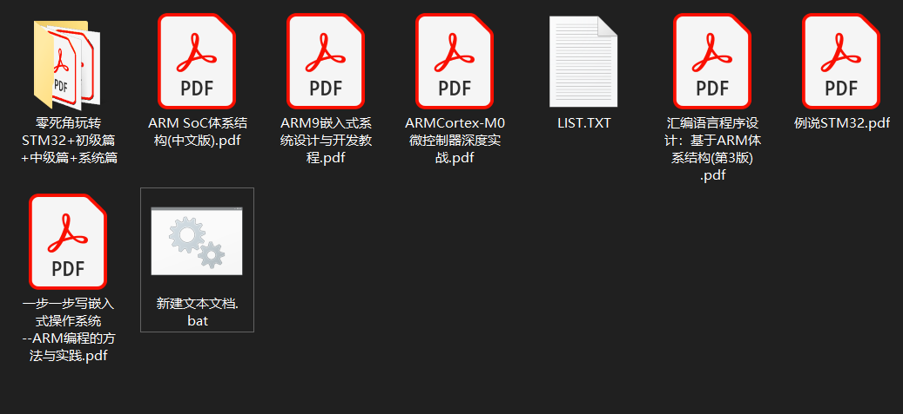
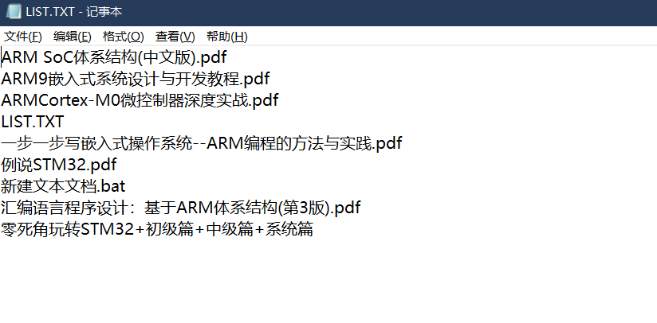

## 强制删除文件的脚本

新建 txt 文件，输入代码：

```
DEL /F /A /Q \\?\%1
RD /S /Q \\?\%1
```

保存，重命名为暴力删除（随意），将后缀名 .txt 更改为 .bat。将需要删除的文件拖动到此脚本图标之上即可。

## Windows查看激活状态

win + R 运行框输入：

- slmgr.vbs -dlv	列出详细的激活信息，含激活ID、安装ID、激活截止日期。
- slmgr.vbs -dli 	列出当前操作系统的版本、一部分产品密钥、激活类型以及许可证状态。
- slmgr.vbs -xpr   显示当前操作系统是否为永久激活。如果不是，则给出截止日期。

## 卸载Office激活密钥

以下是OSPP命令激活方法： 

1. 搜索框输入:cmd  右键以管理员身份运行
2. 输入 cd C:\Program Files\Microsoft Office\Office16按回车，
3. 如果提示路径不正确，请输入 cd C:\Program Files (x86)\Microsoft Office\Office16    按回车
4. 再输入：cscript ospp.vbs /dstatus   按回车查看秘钥状态
5. 输入cscript ospp.vbs /unpkey:XXXXX   (XXXXX就是上步显示的密钥后五位)
6. 最后执行：cscript ospp.vbs /act

## 任务栏显示网速 / 内存 / CPU / GPU

### TrafficMonitor软件地址

**Github：**https://github.com/zhongyang219/TrafficMonitor

**Gitee：**https://gitee.com/zhongyang219/TrafficMonitor

Traffic Monitor是一款用于Windows平台的网速监控悬浮窗软件，可以显示当前网速、CPU及内存利用率，支持嵌入到任务栏显示，支持更换皮肤、历史流量统计等功能。

## 提取文件夹所有文件名

此脚本可以快速将一个文件夹内所有文件的名字列表到一个文本文件中。

1. 新建 .txt 文件
2. 输入内容 `DIR *.* /B >LIST.TXT`
3. 更改后缀名 .txt 为 .bat
4. 将此 .bat 文件放在想要批量提取文件名的父文件夹中，并且双击运行



运行结束会在此目录生成 LIST.TXT 文件，里面即是文件名



说明：此方法学习自 @ https://www.yuque.com/huyuya